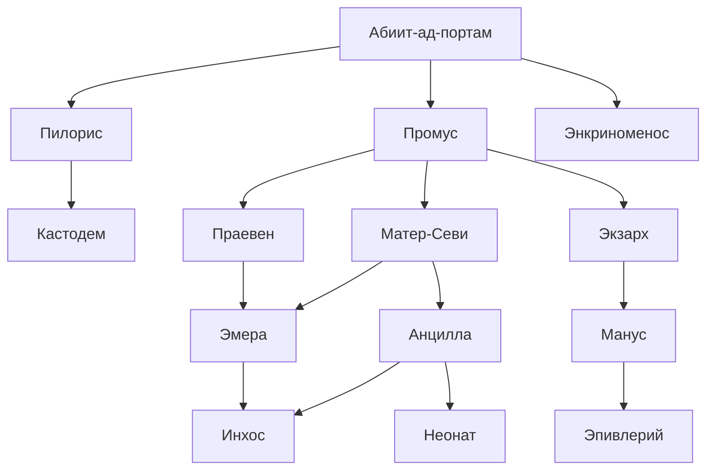

# Особенности
* Цвета: Белый(в свете), Чёрный(в тени), Золотой(правят), Красный(редко, у тех, кто следит за порядком)
* Сильная связь с [[Род Клавис|родом Клавис]] (они занимают верховные должности)
* Долгое продвижение по иерархии (эльфы не любят спешки)
# Покровитель (Йог-Сотот)
## Имена
Ключ, Врата, Хранитель Врат, Тот-Кто-за-Гранью, Всё-в-Одном, Одно-во-Всём, Всесодержащий
## Внешность
Лишь самые крепкие разумом из высших служителей имели возможность узреть часть облика Его.

# Ранги

## Абиит ад портам
* Главы в Астрале
* После 800 лет жизни Пилорис и Промус проходят через ритуал, переносящий их в астрал
## Пилорис
* Мирской глава
* "лицо" рода
* Им становится Кастодем в 400 лет после ухода старого Пилориса
* ![[_ Photo.jpg|200]]
## Кастодем
* Наследник Пилориса
* Старший сын Пилориса
## Промус
* Глава внутренних дел рода
* следит за культом
* Им становится Праевен в 400 лет после ухода старого Промуса
* ![[__.jpg|200]]
## Экриноменос
* Избран [[#Покровитель (Йог-Сотот)|Им]]
* Может быть только младшим сыном Пилориса
* ![[FAN ART GALLERY_ Where the Ocean Meets the Shore _ Critical Role.png|200]]
## Матер Севи
* Матерь слуг
* руководит слугами в Доме
* Жена Промуса
* ![[LaeyrdaValna on Twitter.jpg|200]]
## Экзарх
* Глава контрразведки
* Особо проявивший себя Манус может стать Экзархом при отсутствии Экзарха
## Праевен (что-то про ищущий знания)
* Наследник [[#Промус|Промуса]]
* Младший сын Пилориса или Кастодема, если младший сын Пилориса Экриноменос
* ![[+ W I ₸ H Ξ R G R I И +.jpg|200]]
## Манус
* Исполняет волю [[#Экзарх|Экзарха]]
* Надзор за Анцилами, Матер севи, Кастодемом, Праевеном, Эмера
* Им может стать Проявивший себя Эпивлерий, при необходимости назначения нового Мануса
## Эмера
* Будущая Матер Севи
* Жена Праевена
## Анциллы
* Старшие слуги
* Дети Старших культа без должностей или проявившие себя дети анцилл
* ![[Grief.jpg|200]]

## Эпивлерий
* Следит за младшими слугами
* Анциллы, проявившие правильные качества
* ![[diana-wang-father.jpg|200]]
## Неонат
* Младший прислужник в культе
* Дети Анцилл или проявившие себя Инхос
## Инхос
* Младшие слуги
